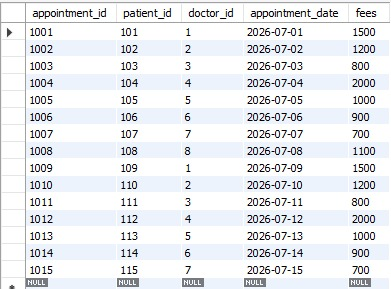
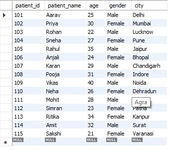
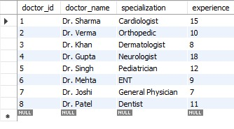
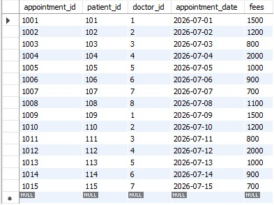
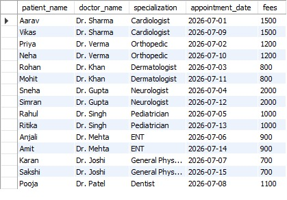
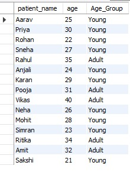

## Hospital Management SQL Project---

## Project Overview

This project demonstrates SQL concepts using a Hospital Management Database. It includes patients, doctors, and appointments tables and performs various SQL operations.

## Tools Used

- MySQL Workbench

## Database

hospital_management

## Tables

- Patients
- Doctors
- Appointments

## SQL Concepts Covered

- CREATE DATABASE
- CREATE TABLE
- INSERT INTO
- SELECT
- WHERE
- ORDER BY
- Aggregate Functions (COUNT, SUM, AVG, MAX, MIN)
- GROUP BY
- CASE WHEN
- INNER JOIN

## Features

- Manage patient records
- Manage doctor records
- Track appointments
- Calculate hospital revenue
- Analyze patient demographics
- Generate doctor-wise revenue

##  Project Screenshots

###  Tables Created

---

###  Patients Table

---

###  Doctors Table

---

###  Appointments Table

---

###  INNER JOIN Output

---

###  CASE WHEN Output

